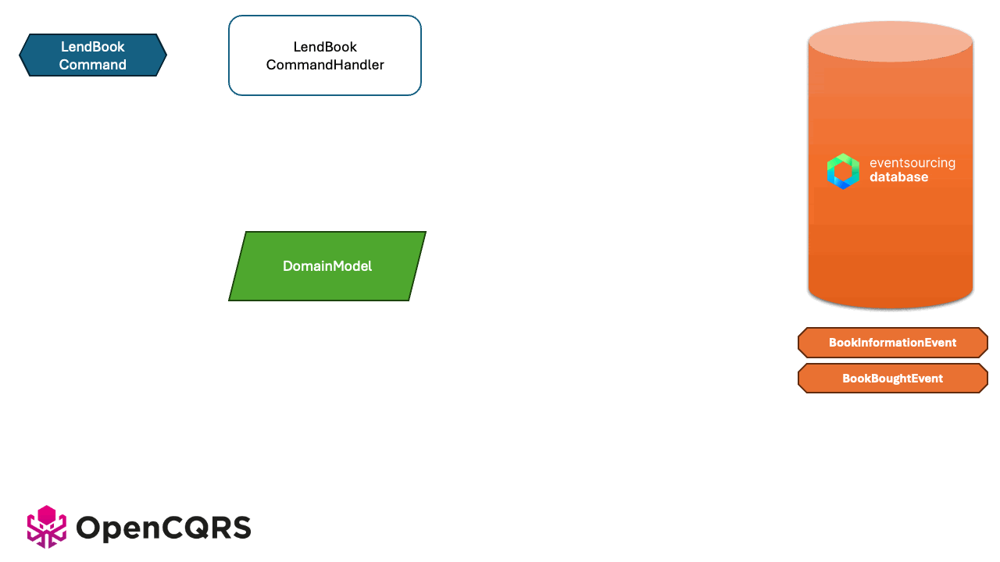

# OpenCQRS – Sample Applications
<!-- BADGES_START -->

<!-- BADGES_END -->

This repository contains a collection of sample applications. Each sample demonstrates how to implement a specific use case commonly encountered when developing software with the [OpenCQRS framework](https://www.opencqrs.com).

## About OpenCQRS and EventSourcingDB

### OpenCQRS

[**OpenCQRS**](https://www.opencqrs.com) is an innovative, opinionated and light-weight framework for the developing applications based on **CQRS (Command Query Responsibility Segregation)** and **Event Sourcing**.  

It provides the means to implement modern architecture patterns like hexagonal architecturs quite easily and with comprehensive sample apps that allow first experiments with CQRS/ES in a matter of minutes.

### EventSourcingDB

[**EventSourcingDB**](https://www.eventsourcingdb.io) is the database that adapts to your business processes like never before. It captures the semantics of your domain events and builds the perfect foundation for your event-driven architecture to take your business to the next level.

## Event Sourcing explained

Event Sourcing is a powerful architectural pattern that records all changes to an application's state as a sequence of immutable events, rather than storing just the current state. This approach provides a complete and auditable history, allowing for reconstruction of past states and enabling complex analytical insights.

### How Event Sourcing Works

Let's break down the typical flow of an event-sourced system:

1. **Command Handling:** It all starts when your application receives a command. This is a request to do something, like "Place Order" or "Add Item to Cart."
2. **Load Domain Model (Aggregate):** The system then loads the relevant domain model object (often called an Aggregate). This object represents the current "version" of the entity the command is acting on.

3. **Query the Event Store:** To load the Aggregate, the system queries the Event Store. This specialized database holds all the historical events for that particular Aggregate.

4. **Rebuild State from Events:** The Aggregate then rebuilds its current state by replaying all its past events from the Event Store, in chronological order. This ensures the Aggregate has the full context before processing the new command.

5. **Validate the Command:** Now, with its state fully reconstructed, the Aggregate can validate the incoming command against its current business rules. For example, if you're trying to add an item to a cart, it might check if the item is in stock.

6. **Publish New Event(s):** If the command is valid, the Aggregate generates one or more new events that describe what just happened (e.g., "Order Placed Event," "Item Added to Cart Event"). These new events are then appended to the Aggregate's stream in the Event Store, becoming part of the immutable history.

This systematic approach ensures data integrity, simplifies auditing, and opens up possibilities for powerful features like "time travel debugging" and sophisticated business intelligence.

## Why OpenCQRS?

We’ve worked with CQRS and Event Sourcing for years – and none of the existing Java frameworks gave us what we needed:

    They were either too heavy, too leaky in abstraction, or lacked clear guidance for beginners.

    When EventSourcingDB emerged, we finally had the foundation we needed to build the framework we always wished had existed.

OpenCQRS is that framework.
Simple enough to get started in minutes. Powerful enough to grow with your system.

## Included Samples

The following scenarios are covered:

- **Filtering Event Streams**  
  Demonstrates how to tag events to efficiently filter the event stream.  
  → [View sample](./filtering-event-streams)

- **Subscribing to Queriess**  
  Shows how to wait for read-side projections to reflect the outcome of a command using polling or reactive subscriptions.  
  → [View sample](./subscription-queries)

- **Implementing Sagas**  
  Explains how to coordinate workflows across long-running, multi-system transactions are known as **Sagas**.  
  → [View sample](./implementing-sagas)

Each sample application can be run locally via `docker-compose` (see the corresponding `docker-compose.yml` files). Interaction is possible using the included Postman and Bruno API collections.

Refer to each app’s individual `README.md` for detailed instructions.

## Requirements

To run the samples locally, ensure the following tools are installed:

- Java 17+
- Docker
- Docker Compose

> ℹ️ *EventSourcingDB runs as a container via the provided `docker-compose.yml` files.*
